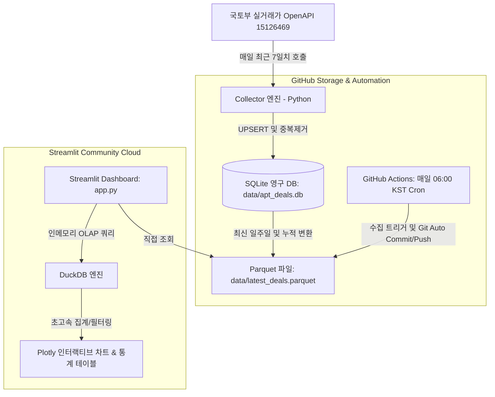

# 🏢 apt-daily: 전국 아파트 실거래가 일일 대시보드

국토교통부 아파트매매 실거래자료 OpenAPI(15126469)를 활용하여 **최근 1주일간의 전국 아파트 매매 실거래가**를 매일 자동으로 수집하고, 초고속 인메모리 OLAP 엔진(DuckDB)과 Parquet/SQLite를 기반으로 시각화하는 Streamlit 대시보드 프로젝트입니다.

외부 유료 데이터베이스나 서버 비용 없이 **GitHub Actions(일일 자동 수집)**와 **Streamlit Community Cloud(무료 대시보드 호스팅)**의 무료 티어만을 100% 활용합니다.

---

## 🏗️ 아키텍처 및 데이터 흐름



### 3대 데이터 기술의 역할
1. **SQLite (`data/apt_deals.db`)**: 거래 고유 해시(`deal_hash`)를 기준으로 `INSERT OR IGNORE` 처리하여 중복 수집 완벽 방지.
2. **Apache Parquet (`data/latest_deals.parquet`)**: 최신 거래 데이터를 열 지향 바이너리로 압축 저장하여 Git 용량 및 배포 전송량 최소화 (수만 건도 수 MB 이내).
3. **DuckDB**: Streamlit 앱 내부에서 Parquet 파일을 인메모리 OLAP 엔진으로 직접 쿼리하여 복잡한 다차원 집계를 밀리초(ms) 단위로 초고속 처리.

---

## 🚀 빠른 시작 (로컬 실행)

### 1. 사전 요구사항
- Python 3.11 이상
- [`uv`](https://github.com/astral-sh/uv) 패키지 매니저

### 2. 가상환경 및 의존성 설치
```bash
# uv로 의존성 동기화
uv sync
```

### 3. 환경 변수 설정
`.env.example`을 복사하여 `.env` 파일을 생성하고 공공데이터포털 및 Gemini API 키를 등록합니다.
```bash
cp .env.example .env
```
```ini
# 공공데이터포털 실거래가 인증키
MOLIT_API_KEY=발급받은_공공데이터_인증키

# Google Gemini API 키 (일자별 AI 마켓 브리핑용)
GEMINI_API_KEY=발급받은_구글_제미나이_인증키
```
> **참고**: API 키가 없어도 `--mock` 모드를 통해 가상 샘플 데이터(500건)로 대시보드의 모든 기능을 즉시 테스트할 수 있습니다.

### 4. 대시보드 화면 구성 (멀티페이지)
- **메인 종합 대시보드 (`app.py`)**: 최근 7일간 전국 시장 종합 트렌드, 시도별 거래량 랭킹, 평형대별 거래가 분포 박스플롯.
- **일자별 상세 & AI 애널리스트 분석 (`pages/1_📅_일자별_거래_및_AI분석.py`)**:
  - 선택 일자의 4대 핵심 지표(건수, 평균가, 평당가, 최고가) 집계.
  - **Google Gemini 1.5 Flash** 기반 부동산 수석 애널리스트 일일 마켓 브리핑 (3줄 핵심 요약, 화제 단지 TOP 3 분석, 투자/실수요 시사점).
  - **SQLite 영구 캐싱**: 최초 1회 생성 후 SQLite DB에 저장되어 동일 날짜 재조회 시 API 호출 없이 0.01초 내 즉시 로드.
  - 당일 실거래 상세 내역 테이블 및 CSV 다운로드.

### 5. 실거래가 데이터 수집 실행
```bash
# 실제 공공데이터 API 수집
uv run python -m src.collector --days 7

# 또는 API 키 없이 Mock 샘플 데이터 생성
uv run python -m src.collector --mock --days 7
```

### 5. Streamlit 대시보드 실행
```bash
uv run streamlit run app.py
```
브라우저에서 `http://localhost:8501` 로 접속하여 대시보드를 확인합니다.

---

## ☁️ 무료 배포 가이드 (GitHub + Streamlit Cloud)

### 1단계: GitHub 저장소 생성 및 푸시
1. GitHub에서 새로운 저장소(Public 권장)를 생성합니다.
2. 프로젝트 코드를 커밋하고 푸시합니다:
   ```bash
   git add .
   git commit -m "feat: initial commit for apt-daily"
   git branch -M main
   git remote add origin https://github.com/당신의계정/apt-daily.git
   git push -u origin main
   ```

### 2단계: GitHub Actions Secret 등록 (일일 자동 수집)
1. GitHub 저장소의 **Settings > Secrets and variables > Actions** 메뉴로 이동합니다.
2. **New repository secret** 버튼을 클릭합니다.
   - Name: `MOLIT_API_KEY`
   - Secret: 공공데이터포털에서 발급받은 국토교통부 아파트매매 실거래자료 일반 인증키
3. 이제 매일 한국 시간 오전 6시(UTC 21:00)에 GitHub Actions가 자동으로 실행되어 최신 데이터를 수집하고 `data/` 디렉터리에 커밋/푸시합니다.
   - **Actions** 탭에서 **Daily Apartment Deals Collector** 워크플로우를 선택하고 **Run workflow**를 누르면 수동으로 즉시 실행할 수도 있습니다.

### 3단계: Streamlit Community Cloud 배포
1. [Streamlit Community Cloud](https://share.streamlit.io/)에 접속하여 GitHub 계정으로 로그인합니다.
2. **New app** 버튼을 클릭합니다.
   - **Repository**: `당신의계정/apt-daily`
   - **Branch**: `main`
   - **Main file path**: `app.py`
3. **Deploy** 버튼을 누르면 배포가 완료됩니다!
4. 이후 GitHub Actions가 매일 아침 새 데이터를 푸시하면, Streamlit Cloud가 이를 자동으로 감지하여 대시보드 화면에 최신 실거래가를 반영합니다.

---

## 🧪 테스트 실행

Superpowers TDD 원칙에 따라 작성된 19개의 유닛 및 통합 테스트를 실행합니다:
```bash
uv run pytest -v
```

---

## 📁 프로젝트 구조

```text
apt-daily/
├── .agents/                    # Superpowers 워크스페이스 스킬
├── .github/
│   └── workflows/
│       └── daily_collect.yml   # GitHub Actions 일일 수집 자동화
├── data/
│   ├── apt_deals.db            # SQLite 영구 데이터베이스 원장
│   └── latest_deals.parquet    # 최신 일주일 실거래가 데이터 (Streamlit 서빙용)
├── src/
│   ├── __init__.py
│   ├── collector.py            # 공공데이터 API 수집 엔진 및 CLI
│   ├── parser.py               # 응답 XML/JSON 정제 및 표준화
│   ├── storage.py              # SQLite UPSERT 및 Parquet 변환
│   ├── constants/
│   │   └── lawd_cd.json        # 전국 250개 시군구 법정동 코드
│   └── dashboard/
│       ├── __init__.py
│       ├── components.py       # KPI 카드 및 Plotly 차트 컴포넌트
│       └── queries.py          # DuckDB 인메모리 OLAP 쿼리 모듈
├── tests/                      # TDD 테스트 스위트 (19개 테스트)
├── app.py                      # Streamlit 대시보드 메인 앱
├── pyproject.toml              # 프로젝트 설정 및 uv 의존성 정의
├── requirements.txt            # Streamlit Community Cloud 배포 호환용
├── .env.example                # 환경변수 템플릿
└── README.md                   # 프로젝트 사용 설명서
```
